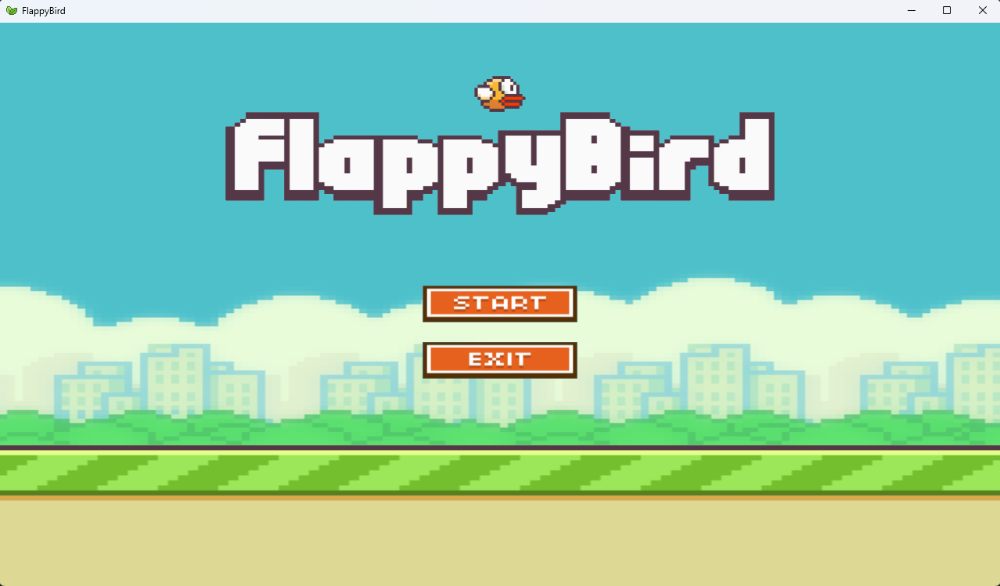
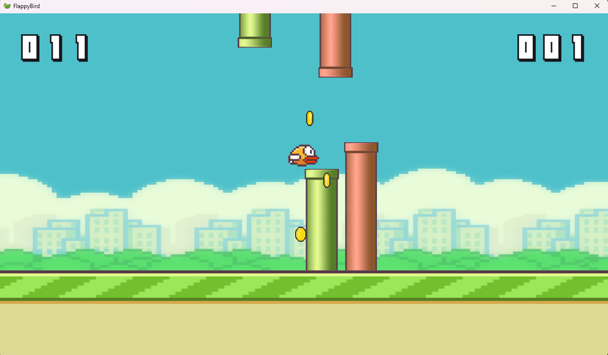
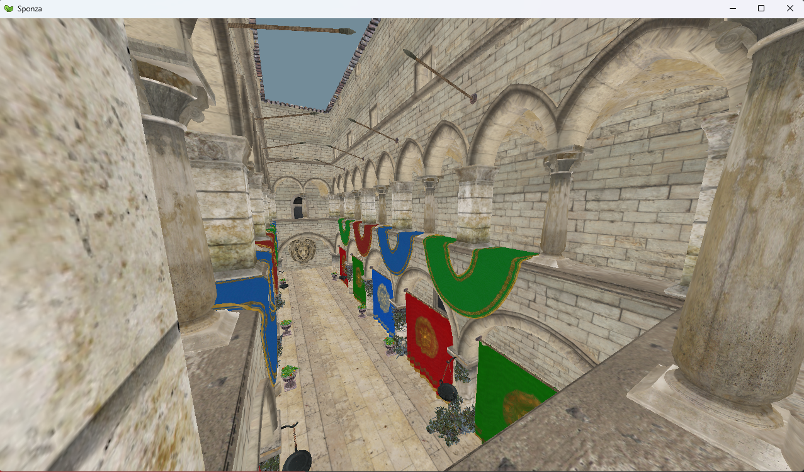

# newleaf_demos

This repository contains a collection of demos that showcase the capabilities of the [newleaf engine](https://github.com/kafkaphoenix/newleaf). 

## Getting Started

To change between demos, modify the `"TARGET_DEMO"` field (e.g., `"TARGET_DEMO": "flappy_bird"` or `"TARGET_DEMO": "sponza"`) in the file `CMakePresets.json`. Logs and settings are stored in `%APPDATA%/Roaming/<DemoName>/`.
> Currently, only Windows environments are supported.

## Debugger

- A debug overlay is available in both demos, which can be toggled with the F3 key. It provides real-time information about the engine's performance and state.

## Flappy Bird

Flappy Bird's clone. Use case for creating a simple 2d game.

### Controls

- **Start**: Start the game
- **Esc**: Quit the game
- **F3**: Toggle debug overlay
- **F12**: Fullscreen toggle
- **Space**: Jump
- **P**: Pause toggle
- **R**: Restart

## Sponza

Sponza's model rendering. Use case for the engine's 3d rendering capabilities. A framebuffer is used for post-processing effects.
They can be changed in the debug overlay.

### Controls

- **Esc**: Quit the rendering
- **F3**: Toggle debug overlay
- **F12**: Fullscreen toggle
- **P**: Pause toggle
- **R**: Restart

